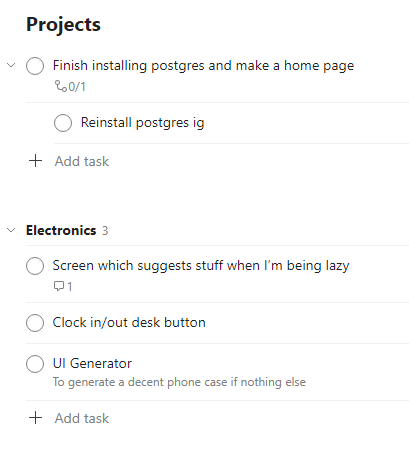
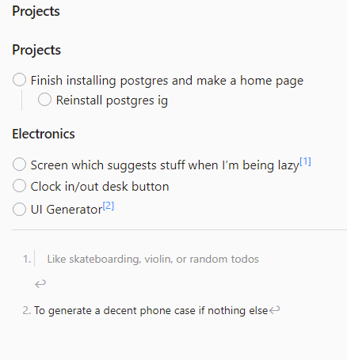

## Convert a Todoist JSON export into Obsidian Markdown

Footnotes are used to keep comments, descriptions, and attachments associated with a task in the markdown.

In the footers, comments are displayed in blockquotes while descriptions are just plaintext.

### Before in Todoist

### After in Obsidian

## Usage
Obtain a JSON dump of your Todoist account from [Export for Todoist](https://darekkay.com/todoist-export/) by Darek Kay

Run the script:
`python parse_todoist.py <json_file>`

## Attachments
To download attachments, install [Full Offline Backup for Todoist](https://github.com/joanbm/full-offline-backup-for-todoist) by [joanbm](https://github.com/joanbm)

Clone the repo and install it with `pip install -e ./full-offline-backup-for-todoist`

Copy [creds.sample.json](creds.sample.json) to `creds.json` and edit with your Todoist information.

Run the `parse_todoist.py` script again and it will download the attachments this time. If you run the script after having already downloaded attachments, make sure to delete the attachments folder first so that it doesn't contain duplicates.